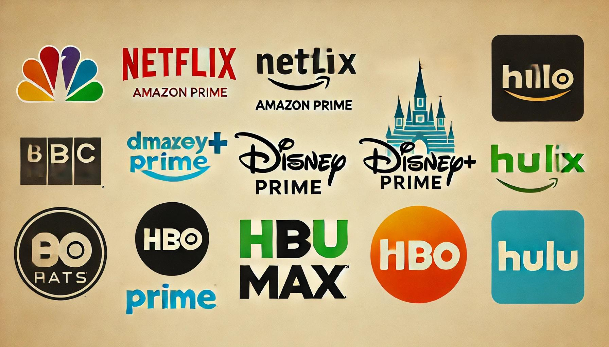

# Movie Recommendation System 
A movie recommendation system is an advanced algorithm designed to suggest films to users based on their preferences and viewing history. By analyzing user data such as previously watched movies, ratings, and viewing patterns, the system predicts and recommends movies that the user is likely to enjoy. On OTT (Over-The-Top) platforms like Netflix, Amazon Prime, and Disney+, these systems play a crucial role in enhancing user experience by offering personalized content. They use techniques such as collaborative filtering, content-based filtering, and hybrid methods to deliver accurate and tailored movie suggestions, thereby increasing user engagement and satisfaction.mkdir images

 
 ## Why build one more MRS when you can watch a movie in any of the OTT ?
Imagine a movie recommendation site tailored specifically to your unique tastes and feelings. Instead of a cluttered screen filled with endless options, this site understands your preferences and recommends movies based on your current mood, the weather, or even special occasions.

Picture this: It's Saturday night, and you're in the mood for a sci-fi adventure. The next weekend, you crave the thrill of a horror film like "The Conjuring." Or perhaps you have a date night planned and want to surprise your significant other with the perfect romantic movie. For someone who struggles to choose what to watch, having a personalized movie recommendation system (MRS) can be a game-changer.

This MRS learns from your viewing habits and preferences, suggesting movies that fit your current state of mind. Whether you're looking for a relaxing film on a rainy day or an exciting blockbuster when you're feeling adventurous, this system ensures you always have the perfect movie lined up.

By focusing on how you feel and what you need at the moment, this personalized approach simplifies your movie-watching experience, making it more enjoyable and tailored to your unique tastes. With this site, finding the right movie becomes effortless, allowing you to fully enjoy your downtime without the hassle of endless searching.
### System Design 

 ## System Design Overview

- **Data Collection**
  - Gather raw data from various sources.

- **Tokenization**
  - Break down the collected data into smaller units, such as words or phrases.

- **Vectorization**
  - Convert the tokenized data into numerical vectors suitable for machine learning algorithms.

- **Database Entry**
  - Store the vectorized data in a database for efficient retrieval.

## Search Process

- **Input: Search Phrase**
  - User inputs a search query.

- **Tokenization of Search Phrase**
  - Break down the search phrase into smaller units.

- **Vectorization of Search Phrase**
  - Convert the tokenized search phrase into a numerical vector.

- **Searching**
  - Match the query vector against the stored vectors in the database to find the closest matches.

- **Result Retrieval**
  - Retrieve the results that are most relevant to the user's query.

- **Render Result**
  - Present the retrieved results in a user-friendly format.

## Summary

- **Data Processing Pipeline**
  - Data Collection -> Tokenization -> Vectorization -> Database Entry

- **Search Query Pipeline**
  - Search Phrase -> Tokenization -> Vectorization -> Searching -> Result -> Render Result

This structured approach ensures that data is efficiently processed, stored, and retrieved, leveraging tokenization and vectorization techniques to enhance search accuracy and speed.

### Results  

